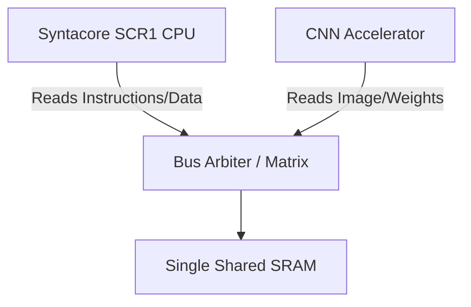
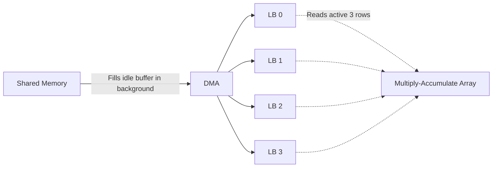

# CNN Accelerator Architecture Reference

This is a living document. We will update it as we refine the design and as you learn more about the different components of the system.

## 1. System Overview: The Shared Memory Concept

In a typical processor-accelerator setup, the CPU often has its own memory (or cache), and the accelerator has its own local memory. The CPU has to copy the image and the weights over to the accelerator before it can start, which creates a huge bottleneck (the "memory wall").

Our design uses a **Unified Shared Memory Architecture** to achieve a "Zero-Copy" design.

### Key Concepts
*   **Zero-Copy:** The CPU loads an image (e.g., from an SD card or network) directly into a specific region of the Shared SRAM. It then simply tells the Accelerator *where* it is. The Accelerator reads it directly from that same spot. No copying between memories is needed.
*   **System Bus Protocol (AHB-Lite):** The CPU, the Accelerator, and the Memory all communicate using the **AMBA AHB-Lite** protocol. We chose AHB-Lite over AXI4 because it drastically reduces logic complexity, avoids handshake deadlocks, and provides perfectly adequate bandwidth for single-cycle SRAM accesses, which aligns with the goal of building a clean, functional accelerator within a university timeline.
*   **Modified Harvard to Von Neumann Mapping:** The SCR1 CPU internally uses a Modified Harvard architecture, meaning it has two physically separate AHB Master ports (`imem` for fetching instructions, and `dmem` for reading/writing variables). However, since we only have one Shared SRAM block, both of these ports—along with the Accelerator's DMA port—must be routed into the exact same memory space (a Von Neumann memory map).
*   **Bus Arbitration (Resolving Contention):** Because we have 3 Masters (`imem`, `dmem`, and `DMA`) trying to talk to 1 Slave (the Shared SRAM), they will inevitably collide if they request access on the exact same clock cycle. We need an **AHB Bus Arbiter** to act as a traffic cop.
    *   **CPU Internal Contention:** If the CPU tries to fetch an instruction (`imem`) and read/write a variable (`dmem`) simultaneously, the arbiter typically gives `dmem` higher priority so the in-flight instruction can finish, stalling the `imem` fetch.
    *   **Accelerator Contention:** If the DMA tries to run while the CPU is awake, it severely degrades performance. This is why we use the software `WFI` (Wait For Interrupt) trick to put the CPU to sleep during convolutions, completely eliminating `imem`/`dmem` traffic and giving the DMA 100% of the bus bandwidth.

### Proposed System Memory Map
This memory map is defined by the Address Decoder within our AHB Bus Arbiter. It dictates where physical hardware lives in the CPU's memory space.

| Address Range | Size | Destination / Peripheral | Description |
| :--- | :--- | :--- | :--- |
| `0x0000_0000` - `0x000F_FFFF` | 1 MB | **Shared SRAM (BRAM)** | Main memory for C code, the MNIST image, CNN weights, and the final result output. |
| `0x0048_0000` - `0x0048_FFFF` | 64 KB | **CPU Internal TCM** | Private, dual-ported memory hardcoded inside the CPU for fast stack/ISR execution. (Not routed through our Arbiter). |
| `0x4000_0000` - `0x4000_00FF` | 256 B | **CNN Accelerator Control** | Memory-mapped control registers (START, STATUS, IMAGE_ADDR, etc.). |
| `0x4000_1000` - `0x4000_10FF` | 256 B | **UART IP Block** | Memory-mapped registers for serial communication (TX, RX, UART_STATUS). |

---

## 2. The AHB Bus Arbiter Architecture

The AHB Bus Arbiter is the central crossbar that connects all masters to all slaves in the system. Because AHB-Lite does not support multiple masters natively, this arbiter acts as a "traffic cop", intercepting requests and routing signals based on strict priority.

### A. Interface Summary
The arbiter exposes 6 total AHB-Lite ports:
*   **3 Master Ports (Inputs to the Arbiter):** 
    *   `cpu_data`: The RISC-V CPU's data fetch port.
    *   `cpu_instr`: The RISC-V CPU's instruction fetch port.
    *   `accel_dma`: The CNN Accelerator's Direct Memory Access engine.
*   **3 Slave Ports (Outputs from the Arbiter):**
    *   `sram`: The Shared Memory (BRAM).
    *   `control_reg`: The CNN Accelerator's configuration registers.
    *   `uart`: The UART peripheral for PC communication.

### B. Internal Operation (The Pipeline)
Because AHB-Lite is a pipelined protocol (the Data Phase occurs one clock cycle after the Address Phase), the Arbiter's logic is split across the time domain using D-Flip-Flop registers.

1.  **The Priority Encoder (Address Phase):** 
    When multiple masters request the bus simultaneously, the Arbiter uses a static priority encoder. The priority is fixed: `cpu_data` > `cpu_instr` > `accel_dma`. The winning master's request is designated as the `grant`.
2.  **The Address Decoder (Address Phase):** 
    The Arbiter reads the winning master's 32-bit address and extracts the top 16 bits to determine the destination slave (e.g., `0x0000` = SRAM, `0x4000` = Control). 
    *   *Broadcast Optimization:* Instead of complex multiplexers, the Arbiter broadcasts the winning master's `haddr`, `hwrite`, and `htrans` to *all* slaves simultaneously. It only asserts the `hsel` (chip select) wire for the specifically decoded slave, ensuring the others ignore the broadcast.
3.  **The State Registers (The Pipeline Delay):**
    The Arbiter stores the winning master (`grant`) and the chosen slave (`sel`) in an `always_ff` register. This "remembers" the transaction for the next clock cycle.
4.  **The Data Muxes (Data Phase):**
    On the next clock cycle, the Arbiter uses the *registered* `grant` and `sel` signals to route the data:
    *   *Master-to-Slave:* The Arbiter routes `hwdata` from the registered winning master to all slaves.
    *   *Slave-to-Master:* The Arbiter routes the `hrdata`, `hready`, and `hresp` from the registered chosen slave back to the masters. For masters that did *not* win the bus, the Arbiter forces their `hready = 0`, stalling them until the bus is free.

### C. Error Handling & The Default Slave
If a master (likely due to a C software bug) attempts to access a memory address that does not exist in the System Memory Map (e.g., `0x8000_0000`), no slave will be selected. 
If the Arbiter did nothing, `hready` would default to `0`, permanently hanging the CPU and deadlocking the entire FPGA. 
To prevent this, the Arbiter implements a **Default Error Slave**. When an unmapped address is detected, the Arbiter intercepts the Data Phase and immediately returns `hready = 1` and `hresp = 1` (ERROR). This successfully terminates the invalid transaction and triggers a hardware fault (HardFault) in the CPU, allowing the software to crash gracefully rather than freezing the silicon.

---

## 3. The CNN Accelerator: Inside the Black Box

The accelerator itself isn't just one block; it's made up of three distinct functional units.

### A. The Control Interface (Slave)
*Note: The CNN Accelerator physically exposes **two completely separate** bundles of AHB wires. One is an AHB Slave (for receiving commands), and one is an AHB Master (the DMA, for fetching data).*

Think of the Control Interface as the dashboard. The CPU is the driver, and it uses this dashboard to steer the accelerator. This interface acts as the **AHB Slave**, containing word-aligned 32-bit registers starting at base address `0x4000_0000`.

**Proposed Register Map:**

| Offset | Address | Name | Access | Purpose |
| :--- | :--- | :--- | :--- | :--- |
| `0x00` | `0x4000_0000` | **CONTROL_REG** | Read/Write | **Bit 0 (`START`):** CPU writes `1` to begin convolution. **Bit 1 (`INT_EN`):** CPU writes `1` to allow the accelerator to trigger the CPU IRQ when done. **Bit 2 (`RESET`):** CPU writes `1` to force the FSM back to idle. |
| `0x04` | `0x4000_0004` | **STATUS_REG** | Read-Only | **Bit 0 (`BUSY`):** Hardware sets to `1` while running. **Bit 1 (`DONE`):** Hardware sets to `1` when finished. |
| `0x08` | `0x4000_0008` | **IMAGE_ADDR** | Read/Write | 32-bit pointer to the start of the image in SRAM. |
| `0x0C` | `0x4000_000C` | **WEIGHT_ADDR** | Read/Write | 32-bit pointer to the start of the filters/weights in SRAM. |
| `0x10` | `0x4000_0010` | **RESULT_ADDR** | Read/Write | 32-bit pointer to where the Accelerator should write the output. |

**Hardware & Software Operation:**
When the CPU executes a C command like `*(volatile uint32_t*)0x40000008 = 0x00010000;`, the AHB Arbiter routes the address and data to this block. If `hwrite == 1` and `hsel` is active, the accelerator latches the data into physical D-Flip-Flops on the next clock cycle. These flip-flops are permanently wired directly to the DMA Engine, so the DMA instantly knows exactly where to fetch data as soon as the CPU writes to the register.

**Physical AHB Slave Interface (113 wires):**
*   **Inputs from Arbiter (79 bits):** `hsel` (1), `haddr` (32), `hwdata` (32), `hwrite` (1), `htrans` (2), `hsize` (3), `hburst` (3), `hprot` (4), `hmastlock` (1)
*   **Outputs to Arbiter (34 bits):** `hrdata` (32), `hreadyout` (1), `hresp` (1)

### B. The DMA Engine (Master)
Direct Memory Access (DMA). Once the CPU hits the `START` bit, the DMA takes over. It acts like a mini-CPU that *only* knows how to fetch and store data. To the Bus Arbiter, it looks exactly like the CPU because it has the same AHB-Lite Master interface (`haddr`, `hwrite`, `hwdata`, `hrdata`, `hready`).

**Physical AHB Master Interface (112 wires):**
*   **Outputs to Arbiter (78 bits):** `haddr` (32), `hwdata` (32), `hwrite` (1), `htrans` (2), `hsize` (3), `hburst` (3), `hprot` (4), `hmastlock` (1)
*   **Inputs from Arbiter (34 bits):** `hrdata` (32), `hready` (1), `hresp` (1)

**Address Generators (Counters):**
Because the DMA is hardware (not running C code), it uses Address Generators (internal counters + adders) instead of software pointers. 
When the `START` bit is flipped, it reads the base addresses from the Control Registers.
*   `fetch_addr = IMAGE_ADDR_REG + offset_counter`

**Read Flow (Fetching Pixels):**
1. The DMA asserts `haddr = fetch_addr`, `hwrite = 0` (Read).
2. It waits for the Arbiter to pull `hready = 1`.
3. It latches the pixel from the `hrdata` bus and pushes it into the Line Buffers.
4. It increments its internal `offset_counter`.

**The `hready` Global Pipeline Stall:**
The DMA state machine *must* respect the `hready` signal from the Arbiter. If an external event wakes the CPU up early, the Arbiter might give the CPU the bus and pull `hready = 0` for the DMA. 
When `hready` goes low, the DMA cannot just freeze its own counters; it must assert a **Global Stall** signal across the entire Accelerator. This `hready` signal acts as a clock-enable for the Line Buffers and the MAC Array. 
*   If `hready = 1`, the DMA fetches, the Line Buffers shift, and the MAC multiplies.
*   If `hready = 0`, the entire accelerator safely freezes in time, preventing the MAC from multiplying garbage data while waiting for the next pixel.

### C. The Datapath (The Math & Line Buffers)
This is where the actual Convolution (Multiply and Accumulate) happens. 

#### The Problem with Convolution
In 2D convolution (like a 3x3 filter), you need a 3x3 window of pixels to compute one output pixel. When you slide the window over by one pixel, you need 6 of the pixels you *just* read, plus 3 new ones. 
If we read all 9 pixels from main memory every time, we would overwhelm the memory bus.

#### The Solution: 4 Ping-Pong Line Buffers
Instead of fetching redundant pixels, the DMA fetches rows of the image and stores them locally inside the accelerator in small, fast, on-chip memories called **Line Buffers**. 
To ensure the MAC array never stalls when moving to a new row, we use **4 Line Buffers** operating in a circular ping-pong fashion:

By keeping the previous rows in line buffers, the MAC array has instant access to the 3x3 grid. While the MAC processes 3 of the buffers, the DMA quietly fills the 4th buffer in the background, drastically reducing memory traffic and maximizing throughput.

> [!NOTE]
> For a comprehensive, step-by-step breakdown of how data flows through the entire 5-stage fused pipeline (including the Max-Pool Line Buffer and the 7 Dense Weight Prefetch Buffers), please see the full [CNN Accelerator Pipeline Overview](pipeline_overview.md).

---

## 4. Peripheral Integration (UART & I/O)

To move data (like the MNIST image) from an external PC into the FPGA's Shared SRAM, we use a single **UART (Universal Asynchronous Receiver-Transmitter)** module.

### A. Architectural Connection
*   The UART is a separate hardware IP block. It is **not** directly connected to the CPU.
*   Instead, it acts as another **AHB Slave** attached to the Bus Arbiter (alongside the SRAM and Accelerator registers). 
*   The CPU communicates with the UART by reading and writing to specific memory-mapped addresses (e.g., `0x4000_1000`) allocated by the Arbiter's Address Decoder.

### B. Full-Duplex Single Module
We only need **one** UART module to handle both directions simultaneously:
*   **`rx` wire:** Reads data *in* from the PC (e.g., downloading the image).
*   **`tx` wire:** Sends data *out* to the PC terminal (e.g., printing the final digit classification).

### C. Data Ingestion Flow (PC -> SRAM)
1.  **Hardware Reception:** The PC sends a byte. The UART receives the bits, forms an 8-bit byte, stores it in its internal `RX_REG`, and sets a "Data Ready" flag.
2.  **CPU Polling:** The CPU, running a loop in software, sees the "Data Ready" flag over the AHB bus.
3.  **CPU Transfer:** The CPU reads the byte from the UART, then immediately performs an AHB write to store that byte into the Shared SRAM. It increments its pointer and waits for the next byte.

### D. Data Egestion Flow (SRAM -> PC)
Once the CNN Accelerator finishes its math, it writes the final digit classification back into the Shared SRAM. To send this result back to the PC:
1.  **CPU Reads Result:** The CPU reads the final result byte from the Shared SRAM over the AHB bus.
2.  **CPU Writes to UART:** The CPU performs an AHB write, sending that byte to the UART's `TX_REG` (e.g., `0x4000_1000`).
3.  **Hardware Transmission:** The UART hardware takes that byte, serializes it into bits, and pumps it out of the `tx` wire at the agreed baud rate.
4.  **Terminal Display:** The PC receives the bits over USB and displays the final digit on your terminal screen.

### E. Buffer Overrun and Flow Control
If the PC sends data faster than the system can store it, the UART's small internal buffer will overflow. We avoid this using the **Speed Imbalance Defense**:
*   The UART baud rate (e.g., 115200 bps) enforces a strict physical speed limit of ~86 microseconds per byte.
*   The SCR1 CPU running at FPGA speeds (e.g., 50 MHz) can read the UART and write to SRAM in just a few clock cycles (~0.2 microseconds). 
*   Because the CPU is vastly faster than the UART transmission speed, it will spend 99% of its time waiting for the next byte. Therefore, **no hardware or software flow control (handshaking) is required** for this system.

---

## 5. Software Flow (CPU Perspective)

This outlines the lifecycle of a single classification run from the perspective of the C code running on the SCR1 CPU.

### Phase 1: Preparation (The Setup)
1. **Boot & Data Loading:** The CPU boots, initializes, and ensures that the MNIST image and the CNN weights are loaded into the Shared SRAM. 

### Phase 2: Configuration (The Hand-off)
2. **Set Pointers:** The CPU writes the starting memory addresses to the Accelerator's control registers via the AHB bus:
   * `Write(IMAGE_ADDR_REG, 0x00010000)`
   * `Write(WEIGHT_ADDR_REG, 0x00020000)`
   * `Write(RESULT_ADDR_REG, 0x00030000)`
3. **Trigger:** The CPU writes a `1` to the `START` bit in the Accelerator's `CONTROL` register. 

### Phase 3: The Run (The Wait)
4. **Wait For Interrupt (WFI):** Once the `START` bit is flipped, the CPU executes a `WFI` (Wait For Interrupt) instruction and essentially goes to sleep. 
   * *Architectural Benefit:* While the CPU is asleep, it makes **zero** requests to the AHB bus. The Accelerator gets 100% undisputed access to the Shared SRAM, allowing it to run at absolute maximum speed without bus contention.

### Phase 4: Completion (The Result)
5. **Wake Up:** The Accelerator finishes writing the final feature map to the SRAM and asserts its hardware IRQ (Interrupt Request) line.
6. **Interrupt Service Routine (ISR):** The CPU wakes up instantly and jumps to the ISR to acknowledge and clear the interrupt.
7. **Process Result:** The CPU reads the final data from the `RESULT_ADDR` in the Shared SRAM, determines the highest probability digit, and outputs the result.

---

## 6. Fault Tolerance & Deadlock Recovery

A critical vulnerability in the `WFI` (sleep) architecture is that if the CNN Accelerator encounters a hardware bug and freezes, it will never assert the `DONE` interrupt. The CPU will sleep forever, deadlocking the system. To recover from this, we can implement one of three mechanisms:

### Option A: Hard Reset (Simplest)
Wire a physical push button on the FPGA board directly to the CPU's `rst_n` pin and the Accelerator's reset pin. If the system hangs, pressing the button wipes the silicon state and reboots the CPU from `0x0000_0000`. This is standard for university testing.

### Option B: The Watchdog Timer (Autonomous)
Add a hardware timer as a slave on the AHB bus, wired to CPU `irq_lines[2]`.
1. The CPU sets the timer for 2 seconds just before hitting `START`, then goes to sleep.
2. If the Accelerator works, it wakes the CPU in 0.1 seconds, and the CPU turns the timer off.
3. If the Accelerator hangs, 2 seconds pass. The timer asserts the IRQ, waking the CPU. The CPU's ISR realizes the Accelerator failed, writes a `1` to the `RESET` bit in the Accelerator's `CONTROL_REG`, and restarts the sequence.

### Option C: UART "Abort" Interrupt (Advanced)
Wire the UART's `rx_ready` signal to CPU `irq_lines[1]`.
1. If the external PC notices a timeout, the PC sends an "ABORT" byte (e.g., `0xFF`) over the serial port.
2. The UART receives the byte and triggers the interrupt, waking the CPU out of `WFI`.
3. The CPU's ISR reads the `0xFF`, recognizes it as an abort command, writes `RESET=1` to the Accelerator, and resets the software state machine.

## 7. CNN Accelerator Dataflow & Pipeline

Based on architectural trade-offs between speed, silicon area, and Arbiter complexity, the CNN Accelerator implements a **1-Layer, 8-Filter Fused Pipeline** over a **32-bit AHB DMA Bus**.

### A. The 1-Layer, 8-Filter Architecture
To classify the 28x28 MNIST images with high accuracy while keeping the SystemVerilog FSM manageable, the accelerator performs:
1.  **Convolution:** 8 different 3x3 filters applied to the 28x28 image.
2.  **Activation:** On-the-fly ReLU (Sign-bit check).
3.  **Max Pooling:** On-the-fly 2x2 window pooling.
4.  **Dense (Fully Connected) Layer:** Maps the pooled pixels to the final 10 digits using 13,520 weights.

*Total SRAM footprint for all weights and biases is ~13.6 KB.*

### B. The Fused Pipeline (Zero-Write Optimization)
To eliminate thousands of slow SRAM writes and reads, the accelerator uses **Layer Fusing**:
*   Instead of writing the 26x26 output of the Convolution to SRAM and reading it back for Pooling, a dedicated **Max-Pool Line Buffer** sits immediately after the Conv MAC array.
*   The pipeline seamlessly flows: `Image -> Conv MAC -> ReLU -> Max-Pool Line Buffer -> Max Pool Circuit -> Dense MAC -> Output Registers`.
*   The intermediate 26x26 feature map only ever exists inside the physical wires of the accelerator and is never written to memory.

### C. The 32-bit DMA and the 1-Cycle Stall
The DMA reads 32-bits (4 bytes/pixels) per clock cycle. 
*   Because the Convolution MAC consumes only 1 pixel per clock cycle, the DMA is inherently idle 75% of the time during image fetches.
*   The DMA uses this idle time to prefetch the Dense layer weights into an internal **Prefetch FIFO**.
*   **The Bandwidth Bottleneck:** When the Max Pool circuit outputs a pixel, the Dense layer instantly needs 10 weights. A 32-bit bus requires 3 clock cycles to fetch 10 weights. Over a 52-cycle period (2 rows of compute), the DMA physically requires 53 clock cycles of bandwidth to fetch the image and all necessary dense weights.
*   **The Solution:** Rather than designing a highly complex and bug-prone 64-bit Asymmetric Arbiter to fix a 1-cycle deficit, the accelerator utilizes a simple `empty` flag on the Prefetch FIFO. If the Dense layer needs weights and the FIFO is empty, it asserts a `global_stall` wire, freezing the entire pipeline for exactly 1 clock cycle until the DMA catches up. This results in an elegant, easy-to-code design with only a ~2% performance penalty.

---

## Glossary & Terminology Clarifications

*   **SRAM (Static Random Access Memory):** In the context of this FPGA project, this refers to **Block RAMs (BRAMs)**. These are dedicated, hard-silicon memory blocks embedded within the FPGA fabric. Unlike external DRAM (like your PC's memory), they do not require refreshing and provide extremely fast, deterministic single-cycle access. Throughout our documentation and IP integration, the terms "SRAM" and "BRAM" are used interchangeably to describe our high-speed, on-chip shared memory.
